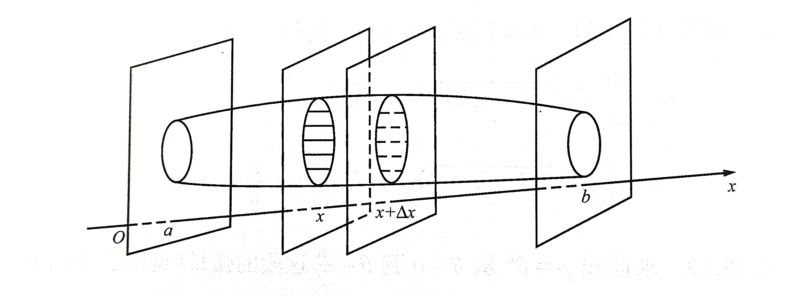
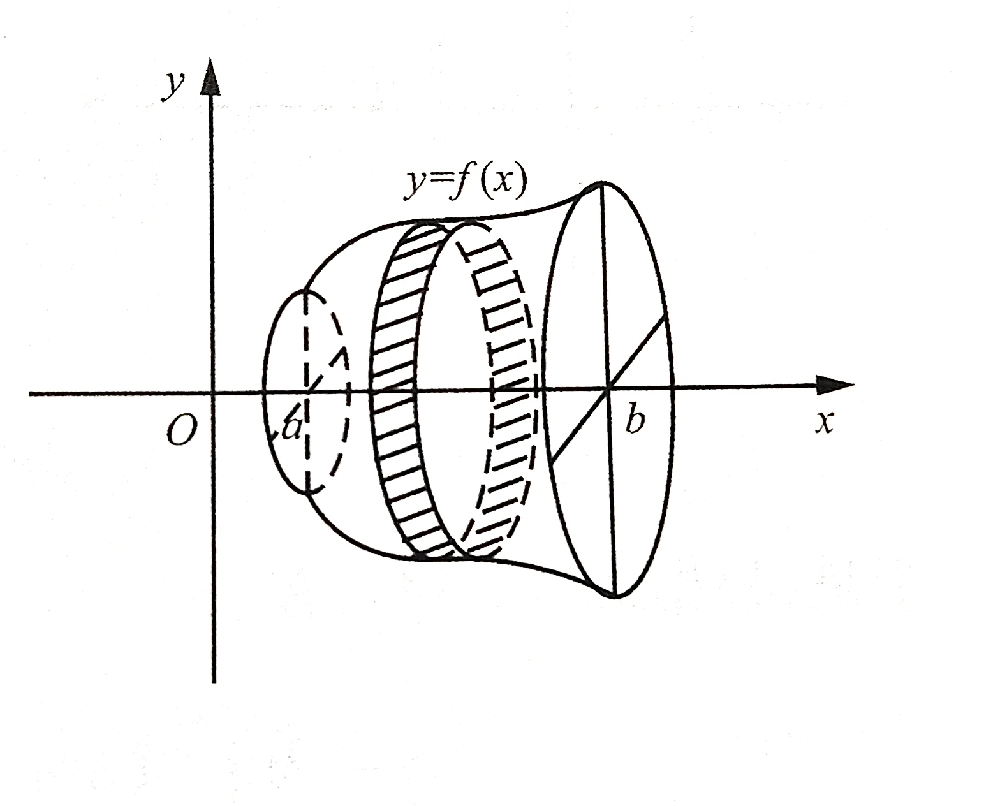

## 2.1 导数

**定义 1.1**  设函数 $y=f(x)$ 在点 $x_0$ 及其附近有定义，如果极限
$$
\lim_{\Delta x \to 0} \frac{f(x_0 + \Delta x) - f(x_0)}{\Delta x}
$$
存在，则称函数 $f(x_0)$ 在 $x_0$ 处可导，并且称这个极限值为 $f(x)$ 在 $x_0$ 处的导数，**记作 ${f'}(x_0)$**，或 $\frac{\mathrm{d} f}{\mathrm{d} x}|_{x=x_0}$，或 $\frac{\mathrm{d} y}{\mathrm{d} x}|_{x=x_0}$，或 ${y}'|_{x=x_0}$.

或$f'(x)=\lim_{? \to 0}{\frac{f(x+?)-f(x)}{?}}=\lim_{? \to x}{\frac{f(?)-f(x)}{?-x}}$

特例：$\lim_{h \to 0}{\frac{f(x_0+ah)-f(x_0)}{h}}=\lim_{h \to 0}{\frac{f(x_0+ah)-f(x_0)}{ah}}\cdot a=af'(x_0)$

## 基本积分表

$\int \frac{1}{x} \mathrm{d}t=ln{\left | x \right |} + C$

$\int x^{\mu}\mathrm{d}x=\frac{1}{\mu+1}x^{\mu+1}+C(\mu\in R, \mu\ne-1)$

$\int a^{x} \mathrm{d}x=\frac{a^{x}}{\ln a}+C$

$\int e^x\mathrm{d}x=e^x+C$

$\int \sin x \mathrm{d}x=-\cos x+C$

$\int \cos x \mathrm{d}x=\sin x+C$

$\int \tan x \mathrm{d}x=-\ln{\left | \cos x \right |}+C$

$\int \cot x \mathrm{d}x=\ln{\left | \sin x \right |}+C$

$\int \sec x \mathrm{d}x=\ln{\left | \sec x+\tan x \right |+C}$

$\int \csc x \mathrm{d}x=\ln{\left | \csc x-\cot x \right |+C}$

$\int \sec^2 x \mathrm{d}x=\tan x+C$

$\int \csc^2 x \mathrm{d}x=-\cot x+C$

$\int \tan x \sec x \mathrm{d}x=\sec x+C$

$\int \cot x \csc x \mathrm{d}x=-\csc x+C$

$\int \arcsin x \mathrm{d}x=x\arcsin x+\sqrt{1-x^2}+C$

$\int \arccos x \mathrm{d}x=x\arccos x-\sqrt{1-x^2}+C$

$\int \frac{1}{x^2+a^2} \mathrm{d}x=\frac{1}{a}\arctan{\frac{x}{a}}+C$

$\int \frac{1}{x^2-a^2} \mathrm{d}x=\frac{1}{2a}\ln{\left | \frac{x-a}{x+a} \right |}+C$

$\int \frac{1}{\sqrt{x^2+a^2}} \mathrm{d}x=\ln{\left | x+\sqrt{x^2+a^2} \right |}+C$

$\int \frac{1}{\sqrt{x^2-a^2}} \mathrm{d}x=\ln{\left | x+\sqrt{x^2-a^2} \right |}+C$

$\int \sqrt{a^2-x^2} \mathrm{d}x=\frac{x}{2}\sqrt{a^2-x^2}+\frac{a^2}{2}\arcsin{\frac{x}{a}}+C$

$\int \sqrt{a^2+x^2} \mathrm{d}x=\frac{x}{2}\sqrt{a^2+x^2}+\frac{a^2}{2}+\ln{\left | x+\sqrt{a^2+x^2} \right |}+C$

$\int \frac{1}{\sqrt{a^2-x^2}} \mathrm{d}x=\arcsin  \frac{x}{a}+C$

$\int \log_{a}{x}\mathrm{d}x=\frac{1}{\ln{a}} \int \ln{x} \mathrm{d}x=\frac{1}{\ln{a}}(x\ln{x}-x)+C$

## 高阶导数

若函数$u(x)$与$v(x)$均存在直到$n$阶导数，则它们的乘积也$n$阶可导，则有下述所谓的莱布尼茨公式：
$$
[u(x)v(x)]^{(x)}=\sum_{k=0}^{n} C_n^k u^{(n-k)}(x) \ v^{(k)}(x)
$$
其中
$$
C_n^k=\frac{n(n-1) \cdots (n-k+1)}{k!}
$$

## 泰勒公式

麦克劳林公式：

$$
f(x)=f(0)+\frac{f'(0)}{1!}x+\frac{f''(0)}{2!}x^2+\cdots +\frac{f^{(n)}(0)}{n!}x^n+o(x^n)
$$

部分常用函数的麦克劳林公式：

$e^x=1+x+\frac{x^2}{2!}+\cdots +\frac{x^n}{n!}+o(x^n)$

$\sin x = x - \frac{x^3}{3!} + \frac{x^5}{5!} + \cdots + (-1)^{m-1}\frac{x^{2m-1}}{(2m-1)!} + o(x^{2m})$

$\cos x = 1 - \frac{x^2}{2!} + \frac{x^4}{4!} + \cdots + (-1)^{m}\frac{x^{2m}}{(2m)!} + o(x^{2m+1})$

$\ln(1+x) = x - \frac{x^2}{2!} + \frac{x^3}{3!} + (-1)^{n-1}\frac{x^n}{n} + \cdots +o(x^{n})$

$(1+x)^{\alpha}=1+\alpha x+ \frac{\alpha(\alpha-1)}{2!}x^2 + \cdots + \frac{\alpha(\alpha-1) \cdots (\alpha-n+1)}{n!}+o(x^n)$

$\frac{1}{1-x}=1+x+x^2+\cdots+x^n+o(x^n)$

$\arctan x=x-\frac{1}{3}x^3+\frac{1}{5}x^5+\cdots+\frac{(-1)^n}{2n+1}x^{2n+1}+o(x^{2n+1})$

$\arcsin x=x-\frac{1}{6}x^3+\frac{3}{40}x^5+\cdots+\frac{(2n)!}{4^n(n!)^2(2n+1)}x^{2n+1}+o(x^{2n+1})$

$\tan x = x + \frac{1}{3}x^3 + \frac{2}{15}x^5 + o(x^5)$

## 函数的凹凸性和作图

前略，（推论）设$f(x)$在$I$上二阶可导：

（1）若$\forall x \in I,f''(x)>0$，则$f(x)$在$I$上严格凸。

（2）若$\forall x \in I,f''(x)<0$，则$f(x)$在$I$上严格凹。

设函数$f(x)$在$x_0$处连续，且在$x_0$点两侧凸凹性相反，则称点$(x_0,f(x_0))$为曲线的**拐点**。

可以证明，若$f''(x)$在$x_0$处存在，且$(x_0,f(x_0))$是拐点，则
$$
f''(x_0)=0
$$

但是$f''(x_0)=0$的点$x_0$未必使$(x_0,f(x_0))$成为拐点。

## 平面曲线的曲率

### 弧微分

弧长微分公式：
$$
\mathrm{d}s=\sqrt{1+y'^2}\mathrm{d}x
$$

微分三角关系（勾股关系）：
$$
\mathrm{d}s^2=\mathrm{d}x^2+\mathrm{d}y^2
$$

若曲线弧是由参数方程$x=\varphi(t),y=\psi(t),\ \alpha \le t \le \beta$或极坐标方程$\rho=\rho(\theta),\ \alpha \le \theta \le \beta$给出，且$\varphi(t),y=\psi(t),\rho(\theta)$均有连续导数，则分别有弧长微分公式：
$$
\mathrm{d}s=\sqrt{[\varphi'(t)]^2+[\psi'(t)]^2}\mathrm{d}t
$$
与
$$
\mathrm{d}s=\sqrt{[\rho(\theta)]^2+[\rho'(\theta)]^2}\mathrm{d}\theta
$$

### 曲线的曲率

设在直角坐标系下曲线方程是$y=f(x)$，且$f(x)$具有二阶导数。则曲率为
$$
k=|\frac{y''}{[1+(y')^2]^{\frac{3}{2}}}|
$$

如果曲线由参数方程$x=\varphi(t),y=\psi(t)$或极坐标方程$\rho=\rho(\theta)$给出，且$\varphi(t),y=\psi(t),\rho(\theta)$均二阶可导，则
$$
k=|\frac{x'_ty''_t-x''_ty'_t}{(x'^2_t+y'^2_t)^{\frac{3}{2}}}|
$$
或
$$
k=|\frac{\rho^2+2\rho'^2-\rho\rho''}{(\rho^2+\rho'^2)^{\frac{3}{2}}}|
$$

## 定积分的概念

设函数$f(x)$在区间$[a,\ b]$上有定义，在$[a,\ b]$内任意插入$n-1$个分点
$$
a=x_0<x_1<x_2<\cdots<x_{n-1}<x_n=b
$$
记此分法为$\Delta$。任取$\xi_k \in [x_{k-1},\ x_k],\ k=1,2,\cdots,n$，作和式
$$
S(\Delta,\ \xi)=\sum_{k=1}^{n} f(\xi_n)\Delta x_k
$$
其中$\Delta x_k=x_k-x_{k-1}, \xi=\{ \xi_k \}$。$S(\Delta,\ \xi)$称为$f(x)$在$[a,\ b]$上的**积分和**（或**黎曼和**）。

令$d(\Delta)=max\{ \Delta x_1, \Delta x_2, \cdots, \Delta x_n \}$，若极限
$$
\lim_{d(\Delta) \to 0}S(\Delta,\ \xi)=\lim_{d(\Delta) \to 0}\sum_{k=1}^{n}f(\xi_k)\Delta x_k
$$
存在，且与分法$\Delta$及$\xi$的选取无关，则称$f(x)$在$[a,\ b]$可积，称此极限值为函数$f(x)$在$[a,\ b]$上的定积分，记作$\int_{a}^{b}f(x) \mathrm{d}x$，即
$$
\int_{a}^{b}f(x) \mathrm{d}x=lim_{d(\Delta)\to0}\sum_{k=1}^{n}f(\xi_k)\Delta x_k
$$

## 定积分的应用

### 平面图形的面积

#### 直角坐标系下平面图形的面积

设平面图形是由曲线$y=f(x)$，$y=g(x)$及直线$x=a,x=b$所围成，其中$f(x) \ge g(x)$，且均在$[a,\ b]$连续。

所求面积为：

$$
S=\int_{a}^{b} [f(x)-g(x)] \mathrm{d}x
$$

#### 极坐标系下平面图形的面积

设曲线的极坐标方程是$r=r(\theta)$，求它与射线$\theta=\alpha$、$\theta=\beta$所围成的曲边扇形的面积，
其中$r=r(\theta)\in C[\alpha,\beta]$。
取极角$\theta$为积分变量，它的变化范围为区间$[\alpha, \beta]$，则曲边扇形的面积可看作展布在$[\alpha, \beta]$上的量。

所求面积为：

$$
S=\int_{\alpha}^{\beta} \mathrm{d} S=\frac{1}{2} \int_{\alpha}^{\beta} r^{2}(\theta) \mathrm{d} \theta
$$

同理，设图形是极坐标方程$r=r_1(\theta),r=r_2(\theta)(r_2(\theta)\ge r(\theta))$确定的二曲线与射线$\theta = \alpha$、$\theta=\beta (\beta >\alpha)$所围成，其面积

$$
S=\frac{1}{2} \int_{\alpha}^{\beta}\left[r_{2}^{2}(\theta)-r_{1}^{2}(\theta)\right] \mathrm{d} \theta
$$

#### 用参数方程表示的曲线所围成的平面图形的面积

如果所给曲线方程为参数形式
$$
\left\{\begin{matrix}
  x=\varphi(t), \\
  y=\psi(t),
\end{matrix}\right. \ \alpha \le t \le \beta
$$
其中$\varphi(t)$单调增加，且$\varphi(\alpha)=a, \varphi(\beta)=b,\varphi'(t) \in C [\alpha,\ \beta]$，则由以上曲线、$x$轴及直线$x=a,x=b$所围成的平面图形面积：
$$
S=\int_{\alpha}^{\beta}|\psi(t)|\varphi'(t)\mathrm{d}t
$$

### 平面曲线的弧长

在$[a,\ b]$上作定积分，得到弧$\stackrel\frown{AB}$的长度
$$
s=\int_a^b\sqrt{1+(y')^2}\mathrm{d}x
$$

当弧$\stackrel\frown{AB}$由参数方程$x=\varphi(t),y=\psi(t),\ \alpha \le t \le \beta$表示时，得
$$
s=\int_a^b\sqrt{[\varphi'(t)]^2+[\psi'(t)]^2}\mathrm{d}t
$$

或极坐标方程$\rho=\rho(\theta),\ \alpha \le \theta \le \beta$表示时，得
$$
s=\int_a^b\sqrt{[r(\theta)]^2+[r'(\theta)]^2}\mathrm{d}\theta
$$

### 平行截面积为已知的空间立体体积

设有位于平面$x=a$和$x=b$ $(a < b)$之间的某一空间立体，它满足如下条件：

1) $\forall x \in [a,\ b]$，过点$(x,\ 0,\ 0)$且垂直于$x$轴的平面去截立体所得界面的面积$S=S(x)$已知；
2) 函数$S(x) \in C[a,\ b]$。

于是根据微元法，所求立体体积
$$
V=\int_a^b \mathrm{d}V = \int_a^bS(x)\mathrm{d}x
$$

旋转体体积：
$$
V=\int_a^bS(x) \mathrm{d}x = \pi\int_a^b[f(x)]^2\mathrm{d}x
$$

薄壳法：
$$
V=\int_a^b \mathrm{d}V = 2\pi\int_a^bxf(x)\mathrm{d}x,\ f(x) \ge 0,\ b > a \ge 0
$$

### 旋转体的侧面积

将平面光滑曲线$y=f(x)(\ge 0)$及直线$x=a$、$x=b$和$y=0$所围成的曲边梯形$ABCD$绕$x$轴旋转一周得到旋转体，求其侧面积$S$。

于是旋转体的侧面积
$$
S=\int_a^b \mathrm{d}S=2\pi \int_a^b f(x) \sqrt{1+[f'(x)]^2} \mathrm{d}x
$$

如果曲线由参数方程$x=\varphi(t),y=\psi(t),\ \alpha \le t \le \beta$表示，则旋转体的侧面积
$$
S=2\pi \int_\alpha^\beta \psi(t)\sqrt{[\varphi'(t)]^2+[\psi'(t)]^2}\mathrm{d}t
$$

如果曲线由极坐标方程$r=r(\theta),\ \alpha \le \theta \le \beta$表示，则旋转体的侧面积
$$
S=2\pi\int_\alpha^\beta r(\theta) \sin\theta \sqrt{[r(\theta)]^2+[r'(\theta)]^2} \mathrm{d}\theta
$$
